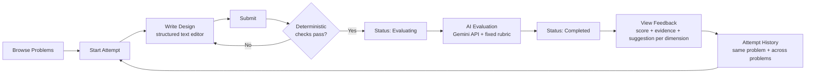
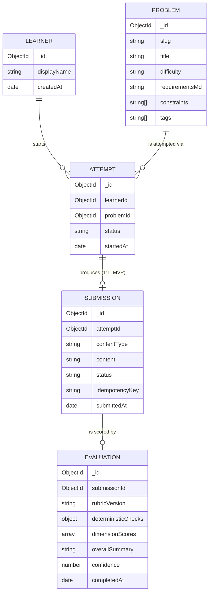
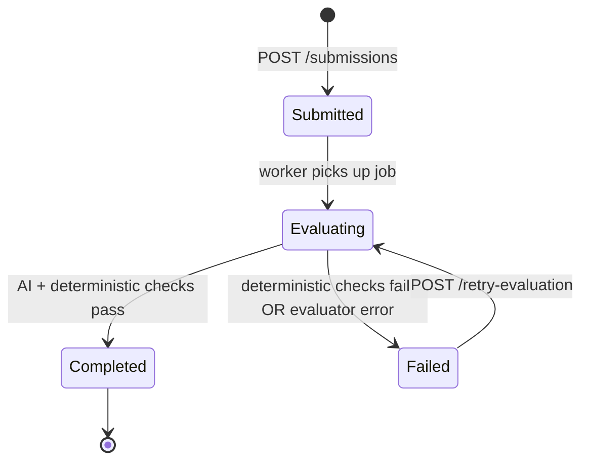

# Design Note — LLD Practice Platform

**Stack:** MongoDB · Express.js · React (TypeScript) · Node.js — MERN, TypeScript end-to-end
**Scope:** 2-day prototype. Every decision below is locked so a coding agent does not need to invent anything. If you want to change a locked decision, edit this file first — the code should follow the doc, not the other way around.

---

## 1. Locked Assumptions (read this before writing any code)

| # | Decision | Locked value |
|---|---|---|
| A1 | Submission format | **Structured text only** (Markdown with required sections). No diagram/code submission in MVP. |
| A2 | Auth | **Single mock learner**, no signup/login flow. A `X-Learner-Id` header (defaulted client-side) stands in for a session. Data model is ref-ready for real auth later. |
| A3 | AI evaluator | **One Gemini API call per submission using `gemini-3.6-flash`**, structured JSON output, fixed rubric. No multi-agent pipeline. |
| A4 | Async model | **In-process job runner** (no Redis/BullMQ for MVP) — evaluation runs on `setImmediate` after the HTTP response returns. Client polls submission status. |
| A5 | Seed data | **5 hardcoded problems**, inserted by a seed script. No admin UI to author problems. |
| A6 | Attempt : Submission | **1 : 1.** Starting a new attempt is how a learner "retries" — there is no draft/multi-submission-per-attempt concept in MVP. |
| A7 | "Feedback" entity | **Not a separate collection.** Feedback is the learner-facing rendering of an `Evaluation` document. Kept as one abstraction because a second one would duplicate the same data with no new behavior (see §8, "abstractions we deliberately did not add"). |

---

## 2. Practice Loop (user flow)



---

## 3. Domain Model

### 3.1 Entities and relationships



> Note on notation: this is MongoDB, so the lines above represent **reference relationships (ObjectId)**, not enforced foreign keys. Referencing (not embedding) is used everywhere because each entity has an independent lifecycle and is queried on its own (e.g., "all evaluations for this learner across problems" for the history/trend view) — embedding would force denormalized copies just to answer that query.

### 3.2 Mongoose schemas

```typescript
// models/Problem.ts
const ProblemSchema = new Schema({
  slug: { type: String, required: true, unique: true, index: true },
  title: { type: String, required: true },
  difficulty: { type: String, enum: ["Easy", "Medium", "Hard"], required: true },
  requirementsMd: { type: String, required: true }, // markdown shown to the learner
  constraints: [{ type: String }],
  tags: [{ type: String, index: true }],
}, { timestamps: true });

// models/Attempt.ts
const AttemptSchema = new Schema({
  learnerId: { type: Schema.Types.ObjectId, ref: "Learner", required: true, index: true },
  problemId: { type: Schema.Types.ObjectId, ref: "Problem", required: true, index: true },
  status: { type: String, enum: ["InProgress", "Submitted"], default: "InProgress" },
  startedAt: { type: Date, default: Date.now },
}, { timestamps: true });
AttemptSchema.index({ learnerId: 1, problemId: 1, createdAt: -1 }); // history queries

// models/Submission.ts
const SubmissionSchema = new Schema({
  attemptId: { type: Schema.Types.ObjectId, ref: "Attempt", required: true, unique: true }, // enforces A6 (1:1) at the DB level
  contentType: { type: String, enum: ["text"], default: "text" }, // enum grows later, see Change Test A
  content: { type: String, required: true },
  status: {
    type: String,
    enum: ["Submitted", "Evaluating", "Completed", "Failed"],
    default: "Submitted",
    index: true,
  },
  idempotencyKey: { type: String, required: true, unique: true }, // client-generated UUID per submit click
  failureReason: { type: String }, // populated only when status === "Failed"
  submittedAt: { type: Date, default: Date.now },
}, { timestamps: true });

// models/Evaluation.ts
const DimensionScoreSchema = new Schema({
  dimension: { type: String, required: true }, // one of the 8 fixed rubric dimensions, see §5
  score: { type: Number, min: 1, max: 5, required: true },
  evidence: { type: String, required: true },   // quoted/paraphrased reference to the learner's own text
  concern: { type: String },
  suggestion: { type: String, required: true },
}, { _id: false });

const EvaluationSchema = new Schema({
  submissionId: { type: Schema.Types.ObjectId, ref: "Submission", required: true, unique: true },
  rubricVersion: { type: String, required: true }, // e.g. "v1" — see §5.3
  evaluatorType: { type: String, enum: ["ai", "deterministic-only"], required: true },
  deterministicChecks: {
    hasRequirementsSection: Boolean,
    hasClassListSection: Boolean,
    hasResponsibilitiesSection: Boolean,
    hasTradeoffsSection: Boolean,
    minLengthMet: Boolean,
  },
  dimensionScores: [DimensionScoreSchema], // absent if deterministic checks failed
  overallSummary: { type: String },
  confidence: { type: Number, min: 0, max: 1 }, // model's self-reported confidence
  completedAt: { type: Date },
}, { timestamps: true });
```

### 3.3 Why referencing (not embedding) `dimensionScores` inside `Submission`
`Evaluation` is a separate collection from `Submission` even though it's 1:1, because they have different write patterns: `Submission` is written once by the learner-facing API; `Evaluation` is written once by the background worker. Keeping them separate means the worker never contends for a write lock on a document the API might also be touching (e.g., a future "edit submission before evaluation starts" feature), and it keeps the rubric-versioned scoring payload independently queryable (e.g., "average score for dimension X across all learners" for a future admin view) without scanning the `Submission` collection.

---

## 4. Backend Class / Interface Design

The evaluation step is the one place the platform must be open to extension (Change Test B) without touching the request/response flow, so it's built around a strategy interface rather than a single hardcoded function.

```typescript
// evaluation/IEvaluator.ts
interface EvaluationResult {
  evaluatorType: "ai" | "deterministic-only";
  deterministicChecks: DeterministicChecks;
  dimensionScores?: DimensionScore[]; // omitted if deterministic checks failed
  overallSummary?: string;
  confidence?: number;
  failureReason?: string;
}

interface IEvaluator {
  evaluate(input: IEvaluationInput): Promise<EvaluationResult>;
}

// evaluation/IEvaluationInput.ts — the abstraction that isolates the evaluator
// from the raw shape of a Submission, so a new contentType doesn't touch the evaluator.
interface IEvaluationInput {
  getEvaluableText(): string;      // normalized text handed to the rubric prompt / rules
  getProblemContext(): ProblemContext; // requirements + constraints, for grounding
}

// evaluation/TextSubmissionInput.ts
class TextSubmissionInput implements IEvaluationInput {
  constructor(private submission: SubmissionDoc, private problem: ProblemDoc) {}
  getEvaluableText() { return this.submission.content; }
  getProblemContext() { return { requirements: this.problem.requirementsMd, constraints: this.problem.constraints }; }
}

// evaluation/DeterministicChecker.ts — always runs first, never calls the LLM
class DeterministicChecker {
  check(text: string): DeterministicChecks { /* required-section + min-length checks, see §5.1 */ }
}

// evaluation/AIEvaluator.ts
class AIEvaluator implements IEvaluator {
  constructor(private checker: DeterministicChecker, private geminiClient: GeminiClient) {}
  async evaluate(input: IEvaluationInput): Promise<EvaluationResult> {
    const checks = this.checker.check(input.getEvaluableText());
    if (!allRequiredChecksPass(checks)) {
      return { evaluatorType: "deterministic-only", deterministicChecks: checks, failureReason: "Missing required sections" };
    }
    const raw = await this.geminiClient.evaluate(RUBRIC_V1, input);
    return { evaluatorType: "ai", deterministicChecks: checks, ...parseAndValidate(raw) };
  }
}

// evaluation/EvaluatorFactory.ts — Change Test B lands here, nowhere else
class EvaluatorFactory {
  static get(evaluatorType: "ai" /* | "rule-based" | "human" later */): IEvaluator {
    switch (evaluatorType) {
      case "ai": return new AIEvaluator(new DeterministicChecker(), geminiClient);
      // case "rule-based": return new RuleBasedEvaluator(...);   // add later, no other file changes
      // case "human": return new HumanReviewEvaluator(...);      // add later, no other file changes
    }
  }
}
```

**Service layer** (orchestration, no business rules leak into controllers):

```typescript
// services/AttemptService.ts
class AttemptService {
  startAttempt(learnerId: string, problemId: string): Promise<Attempt>;
  getHistory(learnerId: string, problemId?: string): Promise<Attempt[]>; // problemId optional = cross-problem history
}

// services/SubmissionService.ts
class SubmissionService {
  // Throws ConflictError if an active (Submitted/Evaluating) submission already
  // exists for this attempt, or if idempotencyKey has been seen before (A6 + idempotency).
  async submit(attemptId: string, content: string, idempotencyKey: string): Promise<Submission>;
  async getStatus(submissionId: string): Promise<{ status: string; evaluation?: Evaluation }>;
  async retryEvaluation(submissionId: string): Promise<void>; // only allowed when status === "Failed"
}

// workers/EvaluationWorker.ts
class EvaluationWorker {
  // Called via setImmediate right after SubmissionService.submit() returns 202.
  async run(submissionId: string): Promise<void> {
    // 1. set status -> Evaluating
    // 2. build IEvaluationInput, get evaluator via EvaluatorFactory
    // 3. evaluate() -> persist Evaluation -> set status -> Completed
    // 4. on any thrown error -> set status -> Failed, store failureReason, never throw out of the worker
  }
}
```

---

## 5. Evaluation Approach

### 5.1 Deterministic checks (run first, free, no LLM cost)
The submission text is parsed for required Markdown headers before anything is sent to Gemini:
- `## Requirements Understanding`
- `## Classes & Responsibilities`
- `## Relationships`
- `## Trade-offs & Assumptions`
- Minimum length: 150 words total.

If any required section is missing, the submission is marked `Failed` with a specific `failureReason` (e.g. `"Missing section: Classes & Responsibilities"`) and **no AI call is made** — this keeps evaluation cost and latency down and gives the learner an instantly actionable, unambiguous error instead of a vague AI comment about missing content.

### 5.2 The 8 rubric dimensions (fixed, from the assignment brief)
| Dimension | What "evidence" looks like |
|---|---|
| Requirement understanding | Reference to a specific stated or reasonably-inferred requirement the design addresses or misses |
| Class responsibilities | Named class + what the learner assigned to it |
| Coupling / cohesion | A specific dependency or shared-state example |
| Encapsulation & interfaces | A specific field/method exposure choice |
| Abstraction / pattern use | Named pattern or abstraction, and whether it fits the problem |
| Extensibility | The specific "what changes later" scenario the design does/doesn't handle |
| Edge cases & testability | A named edge case the learner covered or omitted |
| Quality of explanation | Whether reasoning is stated or only asserted |

Each dimension always returns `{ dimension, score (1–5), evidence, concern, suggestion, confidence }` — never a bare number. This directly targets the gap identified in the Research Note: opaque AI scores don't teach anything, evidence-anchored ones do.

### 5.3 Prompt strategy
- System prompt pins the model to **only** the 8 dimensions above, in a fixed JSON schema, and instructs it to quote or closely paraphrase the learner's own text as `evidence` — never to invent evidence.
- Prompt explicitly forbids a single aggregate "design score out of 100" (this is the anti-pattern the assignment brief calls out directly).
- `rubricVersion` (`"v1"`) is stored on every `Evaluation` so rubric wording can change later without breaking historical comparisons — comparisons across versions are simply flagged in the UI, not silently mixed.
- On a JSON parse failure, retry the call once with the same input; on a second failure, mark `Failed` with `failureReason: "Evaluator error — retry available"` and expose the retry endpoint.

### 5.4 What's deterministic vs. AI (recap)
| Deterministic | AI (Gemini) |
|---|---|
| Required sections present | Class responsibility quality |
| Minimum length | Coupling / cohesion judgment |
| Submission state transitions | SOLID / pattern appropriateness |
| Idempotency / duplicate-submit handling | Extensibility reasoning |
| | Explanation quality |

---

## 6. API Specification

| Method | Route | Auth | Request | Response | Errors |
|---|---|---|---|---|---|
| GET | `/api/problems` | mock learner | — | `Problem[]` (id, title, difficulty, tags) | — |
| GET | `/api/problems/:id` | mock learner | — | `Problem` (full, incl. requirementsMd) | 404 |
| POST | `/api/attempts` | mock learner | `{ problemId }` | `Attempt` (status: InProgress) | 404 problem not found |
| GET | `/api/attempts/:id` | mock learner | — | `Attempt` | 404 |
| GET | `/api/attempts?problemId=&learnerId=` | mock learner | query params | `Attempt[]` sorted by `startedAt desc` | — |
| POST | `/api/attempts/:id/submissions` | mock learner | `{ content, idempotencyKey }` | `202 { submissionId, status: "Submitted" }` | 409 active submission exists; 400 empty content |
| GET | `/api/submissions/:id` | mock learner | — | `{ status, evaluation? }` — poll this until status is terminal | 404 |
| POST | `/api/submissions/:id/retry-evaluation` | mock learner | — | `202 { status: "Evaluating" }` | 409 not in Failed state |
| GET | `/api/learners/history?problemId=` | mock learner | query param optional | `{ attempts, trend: dimensionScore[] over time }` | — |

All error responses use one shape: `{ error: { code, message } }`. All list endpoints are paginated with `?limit=&cursor=` (default `limit=20`) even though MVP data volume doesn't need it — this is free to add now and expensive to retrofit later.

---

## 7. Submission State Machine



**Idempotency / duplicate handling:** the unique index on `Submission.attemptId` means a second `POST /attempts/:id/submissions` on an attempt that already has a non-Failed submission returns `409 Conflict` instead of creating a duplicate. The unique index on `idempotencyKey` additionally absorbs a literal double-click / network-retry of the exact same request.

**Not blocking on slow AI:** `POST /submissions` returns `202 Accepted` with the submission in `Submitted` state the instant it's written to Mongo — the HTTP request never waits on the Gemini API call. The client polls `GET /submissions/:id` (2s interval, capped at ~30s before showing a "still working" state) until `Completed` or `Failed`.

---

## 8. Extensibility — the two change tests

**Change Test A — later support a class-diagram submission:**
`Submission.contentType` is already an enum (`"text"` today). Adding `"diagram"` means: (1) add `"diagram"` to the enum and store the diagram as structured JSON (nodes/edges) in `content` instead of raw markdown; (2) add a `DiagramSubmissionInput implements IEvaluationInput` that serializes nodes/edges into the same normalized text shape (`getEvaluableText()`) the evaluator already consumes. **Nothing in `AIEvaluator`, `EvaluatorFactory`, `SubmissionService`, or the API routes changes** — the evaluator only ever sees the `IEvaluationInput` interface, never the raw submission shape.

**Change Test B — add a rule-based evaluator or human review:**
Implement `RuleBasedEvaluator implements IEvaluator` or `HumanReviewEvaluator implements IEvaluator` and register it in `EvaluatorFactory`. `SubmissionService` and `EvaluationWorker` call `EvaluatorFactory.get(evaluatorType)` and never reference `AIEvaluator` directly, so the practice flow (submit → status → feedback → history) is untouched. `evaluatorType` is already stored on `Evaluation`, so mixed evaluator types coexist in history without a schema change.

### Abstractions deliberately *not* added
- **No separate `Feedback` collection** — it would be a 1:1 read-shape of `Evaluation` with no independent lifecycle or write path, i.e. duplication without new behavior.
- **No `Rubric` collection** — the rubric is a versioned constant in code (`RUBRIC_V1`), not user-editable data in this MVP. Only `rubricVersion` (a string) is persisted, which is enough to know which rubric definition produced a given score without needing rubric CRUD.
- **No repository layer separate from Mongoose models** — at this scale an extra repository interface over Mongoose would be indirection with no swappable implementation behind it. If a second datastore were ever needed, this is the seam to introduce it at — not before.

---

## 9. Scale & Reliability (light HLD, as the brief asks — not a distributed-systems exercise)

- **First thing to separate if this grows:** the `EvaluationWorker` out of the API process into its own worker process consuming a real queue (BullMQ + Redis), because Gemini API latency (seconds) is the one variable-cost operation in the system and shouldn't share a process/CPU budget with request handling.
- **If AI evaluation is slow:** already non-blocking (§7) — this holds regardless of scale, it's a request-response design choice, not a scaling one.
- **If load grows:** `Problem` reads are cacheable (rarely change) — an in-memory cache or Redis in front of `GET /api/problems` is the next-cheapest win before touching the write path.
- **Duplicate processing:** already handled at MVP scale via the unique indexes in §7; at real scale this becomes a queue-level dedup key instead of a DB unique index, same idea.

---

## 10. Testing Strategy

| Layer | What's covered |
|---|---|
| Unit — `DeterministicChecker` | Each required section present/missing, min-length boundary |
| Unit — `AIEvaluator` | Mocked Gemini client: valid JSON parsed correctly; malformed JSON triggers one retry then `Failed`; deterministic failure short-circuits before any Gemini call is made |
| Unit — state machine | Every legal transition in §7; every illegal transition (e.g. `Completed → Evaluating`) throws |
| Integration — API | Full submit → poll → Completed happy path against a running Mongo (via `mongodb-memory-server`) |
| Integration — idempotency | Duplicate `idempotencyKey`; second submit on an attempt that already has an active submission → both return `409` |
| Edge case | Empty/whitespace-only submission → `400` before any DB write |
| Edge case | Gemini API throws/times out → submission ends in `Failed` with a retry available, never stuck in `Evaluating` forever (add a max-evaluating-duration safety check in the worker) |

---

## 11. Trade-offs & Limitations (state these explicitly, don't let the code imply otherwise)

- Text-only submission means the platform cannot yet evaluate an actual class-diagram's visual structure — §8 shows the seam, but it is not built.
- Single mock learner means there's no real multi-user isolation guarantee yet — the schema is ref-ready (`learnerId` everywhere) but auth enforcement is not implemented.
- In-process job runner (A4) means evaluation jobs are lost on a server restart mid-evaluation — acceptable for a 2-day prototype, called out explicitly as the first thing to fix with a real queue (§9).
- One rubric version is live at a time; no side-by-side rubric A/B testing.
