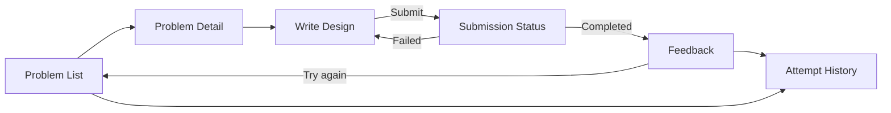

# UI/UX Design Document — LLD Practice Platform

This is a review tool, not a marketing site — a learner arrives with intent (practice a problem, read feedback), so the design is built like an engineering review/diff tool, not a SaaS dashboard with a hero section. That single decision drives everything below.

## 1. Design Principles

1. **Evidence over opinion.** Every score is paired with a specific reference to the learner's own text, shown inline, never hidden behind a tooltip or a second click.
2. **Progression is the story.** Attempt history reads like a version timeline — score deltas and recurring flagged dimensions front and center — not a leaderboard or a percentage badge.
3. **One accent, many neutrals.** The primary blue is reserved for interactive/current-state elements only. Evaluation severity is communicated through a separate, muted three-color semantic set — never mixed with the interactive accent.
4. **Fixed structure for scanning.** The 8 rubric dimensions always render in the same order and position across every submission, so a learner can visually diff two attempts at a glance instead of re-reading each one.

## 2. Token System

### Color — 6 named values, used consistently
| Token | Hex | Use |
|---|---|---|
| `ink` | `#171B21` | Primary text, headlines |
| `canvas` | `#F5F6F3` | App background |
| `panel` | `#FFFFFF` | Cards, editor surface, modals |
| `line` | `#DADDD7` | Hairline borders/dividers — elevation comes from a 1px border, not a drop shadow, on most surfaces |
| `signal` | `#2857C7` | The *only* interactive/current-state accent — primary buttons, active tab, focus ring, links |
| `signal-tint` | `#E7ECF9` | Signal at low opacity, for selected-row backgrounds |

Evaluation semantics (deliberately separate from `signal` so a learner never confuses "this is clickable" with "this is a good/bad score"):
| Token | Hex | Meaning |
|---|---|---|
| `eval-strong` | `#2F7D4F` | Dimension score 4–5 |
| `eval-watch` | `#B4762A` | Dimension score 3 |
| `eval-weak` | `#B33F3F` | Dimension score 1–2 |

### Typography
| Role | Typeface | Notes |
|---|---|---|
| Display / headlines | **Space Grotesk** | Geometric grotesk with a technical edge — used for page titles and problem titles only |
| Body / UI text | **IBM Plex Sans** | Designed for technical documentation; carries the bulk of the interface |
| Code, class names, quoted evidence | **IBM Plex Mono** | Reserved *only* for literal code-like content: the learner's own class/method names when quoted back to them, and excerpted evidence strings. Never used for generic UI labels — that would be decorative, not functional. |

Type scale (base 16px, ratio ~1.25): `12 / 14 / 16 / 20 / 25 / 31 / 39px`. Body copy line length capped at ~72 characters in the editor and feedback panels. No ALL-CAPS labels anywhere; section labels use sentence case.

### Layout
Three-zone grid on desktop: a narrow **context rail** (problem list / navigation, ~240px), a **primary surface** (requirements, editor, or feedback — fluid width, capped at 760px for readability), and a **secondary panel** (rubric summary or trend, ~320px) that collapses below the primary surface on tablet and disappears into a tab on mobile. Left-aligned throughout — nothing centered, nothing justified. This mirrors how a code-review tool lays out file tree / diff / comments, which is the right mental model for "reviewing a design," not a marketing dashboard.

## 3. Component Library

| Component | Spec |
|---|---|
| **Button** | Primary: `signal` fill, white text, 6px radius. Secondary: `panel` fill, 1px `line` border. No arrow glyphs appended to labels — the label states the action directly ("Submit design," "Start attempt," "Try again"). |
| **Input / Textarea** | 1px `line` border, `signal` border + 2px `signal-tint` ring on focus. The design editor is a large `textarea` with a fixed section scaffold pre-filled as commented headers (`## Requirements Understanding`, etc.) so the learner never faces a blank box. |
| **Status Pill** | Small, filled with the relevant semantic color at 15% opacity, text in the full-strength color. Used for `Submitted / Evaluating / Completed / Failed` and for dimension score bands. Not a rounded "badge" copied from a generic kit — shape is a short rectangle with 4px radius, distinct from the Card radius (8px), so pills and cards never read as the same visual family. |
| **Rubric Dimension Row** | Product-specific component: label (body sans) + score pill + evidence block (mono, in a `canvas`-tinted inset, not a shadowed card) + concern + suggestion. This is the single most-repeated component in the product and is the one place the design should feel considered rather than templated. |
| **Panel** (replaces generic "Card") | Flat `panel` fill, single 1px `line` top border only (not a border on all four sides, not a shadow) — a deliberate break from the identical-rounded-card-with-soft-shadow default. The one exception: the panel representing the *current* attempt gets a 2px `signal` left border to mark it as the active item, which is the only place elevation-by-color is used. |
| **Navbar / Context rail** | Text links, no icons-as-primary-navigation (icons only pair with text, never stand alone) — a practice tool for engineers should not force icon-guessing. |
| **Table** (attempt history) | Row-based, hairline row dividers, no zebra striping (would compete visually with the semantic score colors in the same row). |
| **Toast** | Bottom-left, `ink` background, `canvas` text, 4-second auto-dismiss, used only for transient confirmations ("Attempt started") — never for evaluation results, which always live in the permanent feedback panel, not a toast. |

## 4. Screen Specifications

### 4.1 Problem List (home)
- **Purpose:** entry point — browse the 5 seeded problems.
- **Layout:** context rail (filters: difficulty, tag) + primary surface as a single-column list (not a card grid — a grid of 5 identical cards is the SaaS-kit default this brief avoids; a list reads better at this density and scales better as problems are added).
- **Components:** list rows (title, difficulty pill, best score so far if any attempts exist, attempt count).
- **Interactions:** clicking a row opens Problem Detail.
- **Empty state:** not applicable (problems are seeded) — but if the API returns zero problems, show "No problems available yet" in `ink` at 60% opacity, no illustration.
- **Loading state:** row skeletons (flat `line`-colored blocks, no shimmer animation — motion is reserved for the one orchestrated moment per principle in §1).

### 4.2 Problem Detail / Attempt Workspace
- **Purpose:** read requirements, write the design, submit.
- **Layout:** primary surface split top/bottom — requirements (collapsed to a toggleable panel once the learner starts typing, so it doesn't compete for space) above the scaffolded design editor.
- **Components:** requirements panel (rendered markdown), design editor (Input/Textarea with the 4-section scaffold), word count, primary Button ("Submit design," disabled until scaffold sections are non-empty — mirrors the deterministic check from the Design Note so the learner sees the requirement before hitting a 400).
- **Interactions:** "Submit design" transitions to the Submission Status view.
- **Empty state:** first visit to a problem shows the scaffold pre-filled with section headers only.
- **Error state:** if submit is rejected by deterministic checks, the specific missing section is highlighted inline with a short, direct message in the editor's own voice ("Missing: Trade-offs & Assumptions") — not a generic toast.

### 4.3 Submission Status (transient)
- **Purpose:** show progress between Submitted and Completed/Failed.
- **Layout:** centered within the primary surface only (the one screen where centering is appropriate, because there is nothing else to lay out against).
- **Components:** Status Pill (large), a plain-language line per state ("Checking structure," "Reviewing your design") — no spinner-plus-percentage fakery since real progress isn't knowable.
- **Interactions:** auto-navigates to Feedback on `Completed`; on `Failed`, shows the failure reason and a "Try again" Button that starts a new attempt.

### 4.4 Feedback / Evaluation
- **Purpose:** the core value screen — show the 8 Rubric Dimension Rows plus an overall summary.
- **Layout:** primary surface = the 8 Rubric Dimension Rows in fixed order (§1, principle 4); secondary panel = overall summary + confidence + a "Try again" Button.
- **Components:** Rubric Dimension Row (×8), overall summary text block.
- **Interactions:** each row is static (no accordion-hide — hiding evidence behind a click contradicts principle 1).
- **Error/edge state:** if `confidence` is below a threshold, a single plain-language note appears above the summary ("This evaluation has lower confidence than usual — treat the scores as a rough signal"), not a scary warning icon.

### 4.5 Attempt History
- **Purpose:** show progression — within one problem, and across all problems.
- **Layout:** Table (per §3) with columns: problem, date, overall trend indicator, per-dimension mini indicators using the semantic colors (no separate legend needed once a learner has seen one Feedback screen — the colors are already established).
- **Components:** Table, a simple toggle between "This problem" / "All problems" scope.
- **Empty state:** "No attempts yet — start with a problem from the list," linking back to 4.1.

## 5. Wireframe Descriptions

```
Problem List
┌─────────────┬──────────────────────────────────┐
│ Context     │  Problem row: title · difficulty   │
│ rail        │  Problem row: title · difficulty   │
│ (filters)   │  Problem row: title · difficulty   │
│             │  ...                                │
└─────────────┴──────────────────────────────────┘

Attempt Workspace
┌─────────────┬──────────────────────┬────────────┐
│ Context     │  Requirements (toggle)│  (empty on │
│ rail        │  ───────────────────  │   this     │
│             │  Design editor         │   screen)  │
│             │  [Submit design]       │            │
└─────────────┴──────────────────────┴────────────┘

Feedback
┌─────────────┬──────────────────────┬────────────┐
│ Context     │  Rubric Dimension Row │  Summary   │
│ rail        │  Rubric Dimension Row │  Confidence│
│             │  ... (8 total)        │  [Try again]│
└─────────────┴──────────────────────┴────────────┘
```

## 6. User Flow



## 7. Responsive Design
- **Desktop (≥1024px):** full three-zone layout as described in §2.
- **Tablet (640–1023px):** secondary panel moves below the primary surface (stacked, not hidden) — rubric summary and trend data stay reachable by scroll, not behind a tab.
- **Mobile (<640px):** context rail collapses into a top dropdown; secondary panel becomes a swipeable tab next to the primary surface tab ("Design" / "Feedback"). The design editor remains full-width with the requirements panel collapsed by default to maximize typing space.

## 8. Accessibility (WCAG-oriented)
- Text/background contrast: `ink` on `canvas` and `panel` both exceed 12:1; semantic colors (`eval-strong/watch/weak`) are checked to meet 4.5:1 against `panel` and are **never the only signal** — every Status Pill and score also carries a text label (e.g., "Strong," "Watch," "Weak"), not color alone.
- Visible keyboard focus ring on every interactive element (2px `signal-tint` outline), including Rubric Dimension Rows if they ever become expandable in a future iteration.
- All non-decorative icons paired with text labels (§3, Navbar).
- Reduced-motion respected: the one orchestrated moment (feedback panel reveal on evaluation completion) is skipped entirely under `prefers-reduced-motion`, replaced with an instant state change.
- Form errors (missing scaffold section) are announced via `aria-live="polite"` next to the editor, not only via color.

## 9. Design System Details
- **Spacing scale:** 4px base — `4 / 8 / 12 / 16 / 24 / 32 / 48px`.
- **Radius:** 4px for pills, 6px for buttons/inputs, 8px for panels — three distinct values so pills, controls, and surfaces never visually collapse into the same shape.
- **Elevation:** border-based, not shadow-based (§3, Panel) — the only shadow in the product is a single `0 2px 8px rgba(23,27,33,0.08)` on modals, kept intentionally rare so it still reads as "this is on top of everything" when it does appear.
- **Iconography:** a single consistent icon set (Lucide, since it's already available in the project's component ecosystem), outline style only, always 16 or 20px, always paired with a text label.
- **Consistency rule:** any new screen must reuse an existing component from §3 before a new one is proposed — the Rubric Dimension Row and Status Pill in particular should not gain visual variants per screen.
